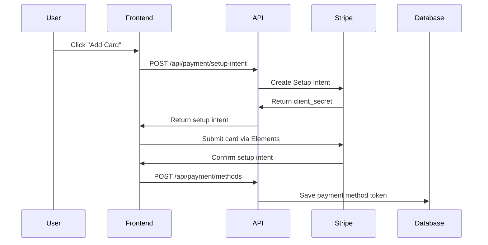
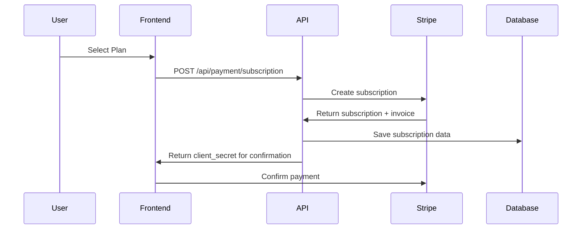

# Stripe Payment Integration Setup Guide

This guide walks you through setting up secure credit card payment processing for your AI Content Repurposer Studio using Stripe.

## 🔒 Security First

**NEVER store credit card information directly in your database.** This implementation uses Stripe's secure tokenization system where:
- Credit card data never touches your servers
- Stripe handles PCI compliance
- You only store secure tokens and references

## 📋 Prerequisites

1. **Stripe Account**: Sign up at [stripe.com](https://stripe.com)
2. **Database Migration**: Run the new Prisma migration (see below)
3. **Environment Variables**: Configure Stripe keys

## 🗄️ Database Schema Updates

The following new models have been added to your Prisma schema:

```prisma
// Payment Models for Stripe Integration
model PaymentMethod {
  id                String   @id @default(cuid())
  userId            String
  stripePaymentMethodId String @unique
  type              String   // card, bank_account, etc.
  brand             String?  // visa, mastercard, etc.
  last4             String?  // last 4 digits
  expiryMonth       Int?
  expiryYear        Int?
  isDefault         Boolean  @default(false)
  createdAt         DateTime @default(now())
  updatedAt         DateTime @updatedAt
  user              User     @relation(fields: [userId], references: [id], onDelete: Cascade)
}

model Subscription {
  id                    String   @id @default(cuid())
  userId                String
  stripeSubscriptionId  String   @unique
  stripePriceId         String
  status                String   // active, canceled, incomplete, etc.
  currentPeriodStart    DateTime
  currentPeriodEnd      DateTime
  cancelAtPeriodEnd     Boolean  @default(false)
  // ... more fields
}

model Invoice {
  id              String   @id @default(cuid())
  userId          String
  stripeInvoiceId String   @unique
  amount          Float
  currency        String   @default("usd")
  status          String   // paid, open, draft, etc.
  // ... more fields
}

model UsageRecord {
  id             String   @id @default(cuid())
  userId         String
  subscriptionId String
  featureType    String   // "content_generation", "ai_analysis", etc.
  quantity       Int      // number of units used
  billingPeriod  String   // "2024-01"
  reportedToStripe Boolean @default(false)
  createdAt      DateTime @default(now())
  user           User     @relation(fields: [userId], references: [id])
  
  @@index([userId, billingPeriod])
  @@index([subscriptionId, billingPeriod])
}
```

### Run Database Migration

```bash
npx prisma generate
npx prisma db push
```

## 🔑 Environment Variables

Add these to your `.env.local` file:

```env
# Stripe Configuration
STRIPE_SECRET_KEY=sk_test_your_stripe_secret_key_here
NEXT_PUBLIC_STRIPE_PUBLISHABLE_KEY=pk_test_your_stripe_publishable_key_here
STRIPE_WEBHOOK_SECRET=whsec_your_webhook_secret_here

# Stripe Price IDs (create these in your Stripe dashboard)
STRIPE_BASIC_PRICE_ID=price_basic_plan_id
STRIPE_PRO_PRICE_ID=price_pro_plan_id  
STRIPE_AGENCY_PRICE_ID=price_agency_plan_id

# Overage Pricing (for usage-based billing) - MUST match SUBSCRIPTION.md
STRIPE_FREE_OVERAGE_PRICE_ID=price_free_overage_id
STRIPE_BASIC_OVERAGE_PRICE_ID=price_basic_overage_id
STRIPE_PRO_OVERAGE_PRICE_ID=price_pro_overage_id
STRIPE_AGENCY_OVERAGE_PRICE_ID=price_agency_overage_id

# API Access (Pay-as-you-go for developers)
STRIPE_API_ACCESS_PRICE_ID=price_api_access_id
```

## ⚠️ CRITICAL: Pricing Consistency Requirements

**ALL pricing must match exactly between Stripe, app functionality, and UI displays:**

### Subscription Plans (Must Match SUBSCRIPTION.md)
- **Free Plan**: $0/month, 5 generations, $0.12 overage
- **Basic Plan**: $6.99/month, 60 generations, $0.10 overage  
- **Pro Plan**: $14.99/month, 150 generations, $0.08 overage
- **Agency Plan**: $29.99/month, 450 generations, $0.06 overage
- **API Access**: $0.10 per request (pay-as-you-go)

### Where Pricing Must Be Consistent:
1. **Stripe Dashboard**: Product prices and IDs
2. **Landing Page**: Pricing tables and feature lists
3. **Settings/Subscription Page**: Current plan display and upgrade options
4. **App Usage Logic**: Enforcement of limits and overage calculations
5. **Database Schema**: Plan limits and pricing stored correctly
6. **Email Notifications**: Billing amounts and plan details

### Validation Checklist:
- [ ] Stripe product prices match SUBSCRIPTION.md exactly
- [ ] Landing page pricing tables reflect correct amounts
- [ ] Settings page shows accurate current plan and pricing
- [ ] Usage limits enforced match plan specifications
- [ ] Overage calculations use correct per-unit pricing
- [ ] Team member limits (Agency: 3 included, $6.99/additional)
- [ ] API pricing matches developer documentation

### Getting Your Stripe Keys

1. **Dashboard**: Go to [Stripe Dashboard](https://dashboard.stripe.com)
2. **Test Mode**: Make sure you're in "Test mode" during development
3. **API Keys**: Navigate to Developers → API Keys
4. **Copy Keys**: 
   - **Publishable Key**: Starts with `pk_test_`
   - **Secret Key**: Starts with `sk_test_`

### Creating Price Objects

1. **Products**: Go to Products in Stripe Dashboard
2. **Create Subscription Products**: Create products for each subscription tier:
   - **Basic Plan**: $6.99/month (60 generations)
   - **Pro Plan**: $14.99/month (150 generations) 
   - **Agency Plan**: $29.99/month (450 generations)
3. **Add Pricing**: Add recurring pricing for each product
4. **Copy Price IDs**: Each will start with `price_`

Note: Free plan doesn't require a Stripe product as it's $0/month, but you'll need overage pricing for it.

### Setting Up Overage Charges

For usage-based billing (like content generation overages), you'll need to set up metered pricing:

#### 1. Create Overage Products

1. **Navigate to Products**: In Stripe Dashboard → Products
2. **Create New Product**: 
   - Name: "Content Generation Overages"
   - Description: "Additional content generations beyond plan limits"
3. **Add Metered Pricing**:
   - Select "Usage is metered"
   - Billing period: Monthly
   - Usage aggregation: "Sum of usage during period"
   - Pricing model: "Per unit" or "Graduated/Volume pricing"

#### 2. Configure Overage Pricing Tiers

Set up metered pricing for each plan tier according to your subscription model:

```
Free Plan Overages:
- Price per additional generation: $0.12
- Price ID: price_free_overage_id

Basic Plan Overages:
- Price per additional generation: $0.10
- Price ID: price_basic_overage_id

Pro Plan Overages:  
- Price per additional generation: $0.08
- Price ID: price_pro_overage_id

Agency Plan Overages:
- Price per additional generation: $0.06  
- Price ID: price_agency_overage_id
```

#### 3. API Access (Pay-as-you-go)

For developer/API access:
```
API Access:
- Price per API request: $0.10
- Price ID: price_api_access_id
```

#### 4. Add Overage Price IDs to Environment

Add these to your `.env.local`:

```env
# Overage Pricing (must match subscription model exactly)
STRIPE_FREE_OVERAGE_PRICE_ID=price_free_overage_id
STRIPE_BASIC_OVERAGE_PRICE_ID=price_basic_overage_id
STRIPE_PRO_OVERAGE_PRICE_ID=price_pro_overage_id
STRIPE_AGENCY_OVERAGE_PRICE_ID=price_agency_overage_id

# API Access (Pay-as-you-go)
STRIPE_API_ACCESS_PRICE_ID=price_api_access_id
```

#### 4. Metered Billing Implementation

The system will track usage and report to Stripe:

```typescript
// Report usage to Stripe (implement in your usage tracking)
const reportUsage = async (subscriptionItemId: string, quantity: number) => {
  await stripe.subscriptionItems.createUsageRecord(subscriptionItemId, {
    quantity,
    timestamp: Math.floor(Date.now() / 1000),
  });
};
```

#### 5. Database Schema for Usage Tracking

Add to your Prisma schema:

```prisma
model UsageRecord {
  id             String   @id @default(cuid())
  userId         String
  subscriptionId String
  featureType    String   // "content_generation", "ai_analysis", etc.
  quantity       Int      // number of units used
  billingPeriod  String   // "2024-01"
  reportedToStripe Boolean @default(false)
  createdAt      DateTime @default(now())
  user           User     @relation(fields: [userId], references: [id])
  
  @@index([userId, billingPeriod])
  @@index([subscriptionId, billingPeriod])
}
```

#### 6. Usage-Based Billing Flow

1. **Track Usage**: Record each content generation in `UsageRecord`
2. **Check Limits**: Compare against plan limits
3. **Report Overages**: Send usage data to Stripe monthly
4. **Bill Customer**: Stripe automatically bills for overages

## 📱 Frontend Integration

### Using the AddPaymentMethod Component

```tsx
import AddPaymentMethod from '@/components/payment/add-payment-method';

function PaymentSettings() {
  const handlePaymentMethodAdded = (paymentMethod) => {
    console.log('Payment method added:', paymentMethod);
    // Refresh payment methods list
  };

  return (
    <AddPaymentMethod 
      onSuccess={handlePaymentMethodAdded}
      setAsDefault={true}
    />
  );
}
```

## 🔄 API Endpoints

### Setup Intent (Secure Card Collection)
```
POST /api/payment/setup-intent
```
Creates a setup intent for collecting payment methods securely.

### Payment Methods Management
```
GET /api/payment/methods         # List user's payment methods
POST /api/payment/methods        # Add new payment method
```

### Subscription Management
```
GET /api/payment/subscription    # Get current subscription
POST /api/payment/subscription   # Create subscription
```

## 🎯 How It Works

### 1. **Adding a Payment Method**


### 2. **Creating a Subscription**


## 🛡️ Security Features

✅ **PCI Compliance**: Handled by Stripe
✅ **Tokenization**: No card data in your database
✅ **3D Secure**: Automatic fraud protection
✅ **Encryption**: All data encrypted in transit and at rest
✅ **Webhooks**: Real-time payment event handling

## 🧪 Testing

### Test Card Numbers

```
Visa:           4242 4242 4242 4242
Mastercard:     5555 5555 5555 4444
Declined:       4000 0000 0000 0002
3D Secure:      4000 0000 0000 3220
```

- **CVV**: Any 3 digits
- **Expiry**: Any future date
- **ZIP**: Any valid postal code

## 🚀 Production Checklist

- [ ] Switch to live Stripe keys (pk_live_, sk_live_)
- [ ] Set up webhooks endpoint
- [ ] Configure proper error handling
- [ ] Set up monitoring and alerts
- [ ] Review Stripe compliance requirements
- [ ] Test all payment flows
- [ ] Set up proper logging

## 📞 Support

- **Stripe Documentation**: [stripe.com/docs](https://stripe.com/docs)
- **React Stripe.js**: [stripe.com/docs/stripe-js/react](https://stripe.com/docs/stripe-js/react)
- **Payment Intents**: [stripe.com/docs/payments/payment-intents](https://stripe.com/docs/payments/payment-intents)

---

## 🎉 Benefits of This Implementation

1. **Security**: PCI compliant out of the box
2. **User Experience**: Smooth, modern payment flow
3. **Scalability**: Handles global payments
4. **Flexibility**: Easy to add new payment methods
5. **Compliance**: Automatic fraud protection
6. **Analytics**: Rich payment analytics in Stripe dashboard

## 📊 Implementing Pricing Consistency

### 1. Create a Centralized Pricing Configuration

Create a single source of truth for all pricing in your codebase:

```typescript
// lib/pricing-config.ts
export const PRICING_CONFIG = {
  plans: {
    free: {
      name: 'Free',
      price: 0,
      monthlyLimit: 5,
      overagePrice: 0.12,
      features: ['Basic AI model', 'Twitter & Instagram templates'],
      stripePriceId: null, // Free plan doesn't need Stripe price
      stripeOveragePriceId: process.env.STRIPE_FREE_OVERAGE_PRICE_ID
    },
    basic: {
      name: 'Basic',
      price: 6.99,
      monthlyLimit: 60,
      overagePrice: 0.10,
      features: ['Standard AI model', 'Twitter, Instagram & Facebook templates', 'Basic support'],
      stripePriceId: process.env.STRIPE_BASIC_PRICE_ID,
      stripeOveragePriceId: process.env.STRIPE_BASIC_OVERAGE_PRICE_ID
    },
    pro: {
      name: 'Pro',
      price: 14.99,
      monthlyLimit: 150,
      overagePrice: 0.08,
      features: ['Advanced AI model', 'All platforms + custom templates', 'Professional support'],
      stripePriceId: process.env.STRIPE_PRO_PRICE_ID,
      stripeOveragePriceId: process.env.STRIPE_PRO_OVERAGE_PRICE_ID
    },
    agency: {
      name: 'Agency',
      price: 29.99,
      monthlyLimit: 450,
      overagePrice: 0.06,
      teamMembers: 3,
      additionalMemberPrice: 6.99,
      features: ['Advanced AI model', 'Priority support', 'Team collaboration'],
      stripePriceId: process.env.STRIPE_AGENCY_PRICE_ID,
      stripeOveragePriceId: process.env.STRIPE_AGENCY_OVERAGE_PRICE_ID
    }
  },
  api: {
    pricePerRequest: 0.10,
    stripePriceId: process.env.STRIPE_API_ACCESS_PRICE_ID
  }
} as const;

export type PlanType = keyof typeof PRICING_CONFIG.plans;
```

### 2. Usage Enforcement Middleware

```typescript
// lib/usage-middleware.ts
import { PRICING_CONFIG } from './pricing-config';

export async function checkUsageLimit(userId: string, plan: PlanType) {
  const user = await getUserWithUsage(userId);
  const planConfig = PRICING_CONFIG.plans[plan];
  
  if (user.usageThisMonth >= planConfig.monthlyLimit) {
    return {
      allowed: false,
      message: `Monthly limit of ${planConfig.monthlyLimit} generations reached`,
      overagePrice: planConfig.overagePrice
    };
  }
  
  return { allowed: true };
}
```

### 3. Pricing Display Components

Use the centralized config in your UI components:

```tsx
// components/PricingTable.tsx
import { PRICING_CONFIG } from '@/lib/pricing-config';

export function PricingTable() {
  return (
    <div className="grid grid-cols-1 md:grid-cols-4 gap-6">
      {Object.entries(PRICING_CONFIG.plans).map(([key, plan]) => (
        <PricingCard 
          key={key}
          planKey={key}
          name={plan.name}
          price={plan.price}
          limit={plan.monthlyLimit}
          overage={plan.overagePrice}
          features={plan.features}
        />
      ))}
    </div>
  );
}
```

### 4. Stripe Integration with Config

```typescript
// lib/stripe-helpers.ts
import { PRICING_CONFIG } from './pricing-config';

export function createCheckoutSession(planType: PlanType, userId: string) {
  const plan = PRICING_CONFIG.plans[planType];
  
  return stripe.checkout.sessions.create({
    price: plan.stripePriceId,
    // ... other session config
  });
}

export function calculateOverageCharges(planType: PlanType, overageCount: number) {
  const plan = PRICING_CONFIG.plans[planType];
  return overageCount * plan.overagePrice;
}
```