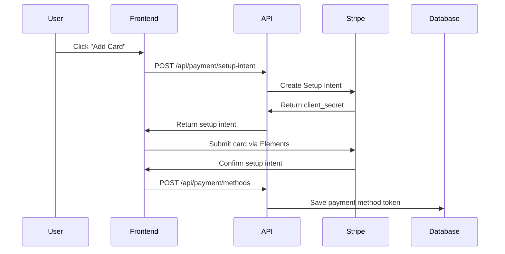
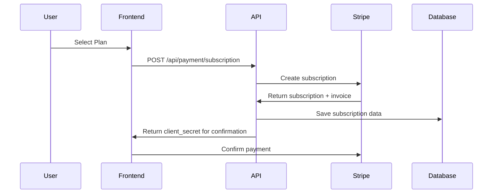

# Stripe Payment Integration Setup Guide

This guide walks you through setting up secure credit card payment processing for your AI Content Repurposer Studio using Stripe.

## 🔒 Security First

**NEVER store credit card information directly in your database.** This implementation uses Stripe's secure tokenization system where:
- Credit card data never touches your servers
- Stripe handles PCI compliance
- You only store secure tokens and references

## 📋 Prerequisites

1. **Stripe Account**: Sign up at [stripe.com](https://stripe.com)
2. **Database Migration**: Run the new Prisma migration (see below)
3. **Environment Variables**: Configure Stripe keys

## 🗄️ Database Schema Updates

The following new models have been added to your Prisma schema:

```prisma
// Payment Models for Stripe Integration
model PaymentMethod {
  id                String   @id @default(cuid())
  userId            String
  stripePaymentMethodId String @unique
  type              String   // card, bank_account, etc.
  brand             String?  // visa, mastercard, etc.
  last4             String?  // last 4 digits
  expiryMonth       Int?
  expiryYear        Int?
  isDefault         Boolean  @default(false)
  createdAt         DateTime @default(now())
  updatedAt         DateTime @updatedAt
  user              User     @relation(fields: [userId], references: [id], onDelete: Cascade)
}

model Subscription {
  id                    String   @id @default(cuid())
  userId                String
  stripeSubscriptionId  String   @unique
  stripePriceId         String
  status                String   // active, canceled, incomplete, etc.
  currentPeriodStart    DateTime
  currentPeriodEnd      DateTime
  cancelAtPeriodEnd     Boolean  @default(false)
  // ... more fields
}

model Invoice {
  id              String   @id @default(cuid())
  userId          String
  stripeInvoiceId String   @unique
  amount          Float
  currency        String   @default("usd")
  status          String   // paid, open, draft, etc.
  // ... more fields
}
```

### Run Database Migration

```bash
npx prisma generate
npx prisma db push
```

## 🔑 Environment Variables

Add these to your `.env.local` file:

```env
# Stripe Configuration
STRIPE_SECRET_KEY=sk_test_your_stripe_secret_key_here
NEXT_PUBLIC_STRIPE_PUBLISHABLE_KEY=pk_test_your_stripe_publishable_key_here
STRIPE_WEBHOOK_SECRET=whsec_your_webhook_secret_here

# Stripe Price IDs (create these in your Stripe dashboard)
STRIPE_BASIC_PRICE_ID=price_basic_plan_id
STRIPE_PRO_PRICE_ID=price_pro_plan_id  
STRIPE_AGENCY_PRICE_ID=price_agency_plan_id
```

### Getting Your Stripe Keys

1. **Dashboard**: Go to [Stripe Dashboard](https://dashboard.stripe.com)
2. **Test Mode**: Make sure you're in "Test mode" during development
3. **API Keys**: Navigate to Developers → API Keys
4. **Copy Keys**: 
   - **Publishable Key**: Starts with `pk_test_`
   - **Secret Key**: Starts with `sk_test_`

### Creating Price Objects

1. **Products**: Go to Products in Stripe Dashboard
2. **Create Product**: Create products for Basic, Pro, Agency plans
3. **Add Pricing**: Add recurring pricing for each product
4. **Copy Price IDs**: Each will start with `price_`

## 📱 Frontend Integration

### Using the AddPaymentMethod Component

```tsx
import AddPaymentMethod from '@/components/payment/add-payment-method';

function PaymentSettings() {
  const handlePaymentMethodAdded = (paymentMethod) => {
    console.log('Payment method added:', paymentMethod);
    // Refresh payment methods list
  };

  return (
    <AddPaymentMethod 
      onSuccess={handlePaymentMethodAdded}
      setAsDefault={true}
    />
  );
}
```

## 🔄 API Endpoints

### Setup Intent (Secure Card Collection)
```
POST /api/payment/setup-intent
```
Creates a setup intent for collecting payment methods securely.

### Payment Methods Management
```
GET /api/payment/methods         # List user's payment methods
POST /api/payment/methods        # Add new payment method
```

### Subscription Management
```
GET /api/payment/subscription    # Get current subscription
POST /api/payment/subscription   # Create subscription
```

## 🎯 How It Works

### 1. **Adding a Payment Method**


### 2. **Creating a Subscription**


## 🛡️ Security Features

✅ **PCI Compliance**: Handled by Stripe
✅ **Tokenization**: No card data in your database
✅ **3D Secure**: Automatic fraud protection
✅ **Encryption**: All data encrypted in transit and at rest
✅ **Webhooks**: Real-time payment event handling

## 🧪 Testing

### Test Card Numbers

```
Visa:           4242 4242 4242 4242
Mastercard:     5555 5555 5555 4444
Declined:       4000 0000 0000 0002
3D Secure:      4000 0000 0000 3220
```

- **CVV**: Any 3 digits
- **Expiry**: Any future date
- **ZIP**: Any valid postal code

## 🚀 Production Checklist

- [ ] Switch to live Stripe keys (pk_live_, sk_live_)
- [ ] Set up webhooks endpoint
- [ ] Configure proper error handling
- [ ] Set up monitoring and alerts
- [ ] Review Stripe compliance requirements
- [ ] Test all payment flows
- [ ] Set up proper logging

## 📞 Support

- **Stripe Documentation**: [stripe.com/docs](https://stripe.com/docs)
- **React Stripe.js**: [stripe.com/docs/stripe-js/react](https://stripe.com/docs/stripe-js/react)
- **Payment Intents**: [stripe.com/docs/payments/payment-intents](https://stripe.com/docs/payments/payment-intents)

---

## 🎉 Benefits of This Implementation

1. **Security**: PCI compliant out of the box
2. **User Experience**: Smooth, modern payment flow
3. **Scalability**: Handles global payments
4. **Flexibility**: Easy to add new payment methods
5. **Compliance**: Automatic fraud protection
6. **Analytics**: Rich payment analytics in Stripe dashboard 